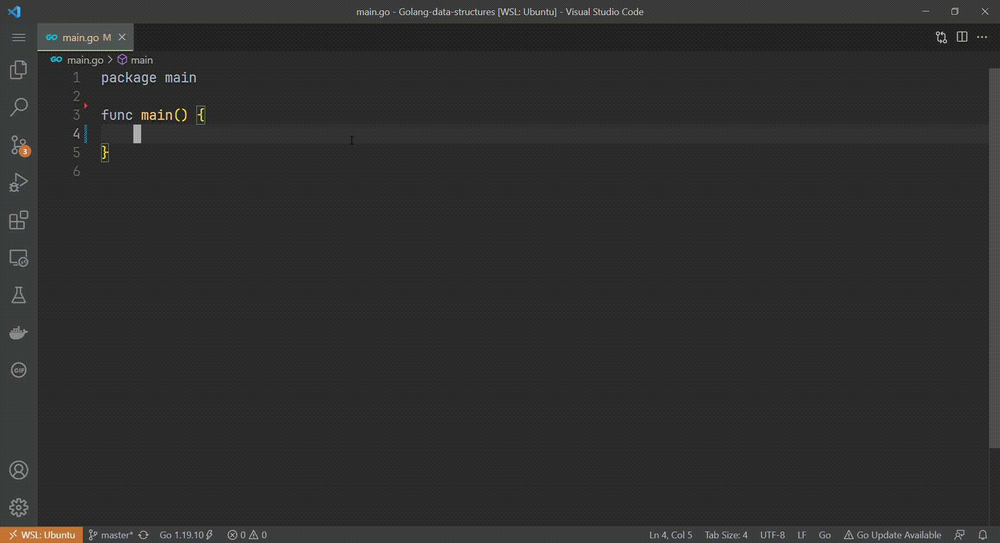

## Golang Data Structures
Data structure and algorithm with golang.
Currently available:
- Data structures:
	- Stack
	- Queue
	- Singly Linked list
	- Binary Search Tree
- Sorting algorithms:
	- Bubble sort

#### Usage
Simply just call the **data_structure** or **sort** packages in **main.go** file

feel free to play around✌.
